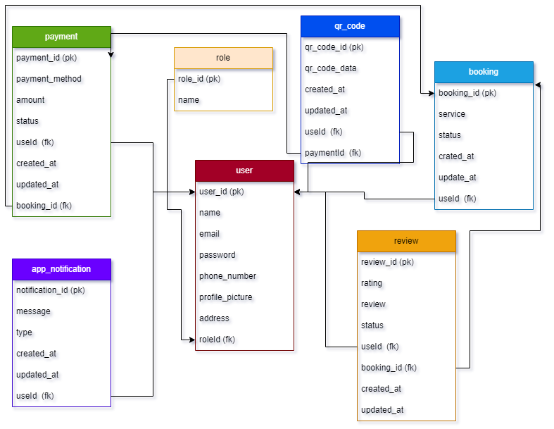

# Banking App Database Schema

Banking Appilication Database schema.

## Database Schema



## Installation

Fist step is to create & run the migration.

## 1 - Geneate Migration

```bash
$  npm run migration:generate -- src/db/migrations/userMigration
```

## 2 - Run Generated Migration

```bash
$ npm run migration:run
```

## Now Run the Nest Server

```bash
$ npm start
```

!!---------------------------------------------------------------------------------------!!

                        For Specific File Test cases

!! --------------------------------------------------------------------------------------- !!

```bash
$ npm run test -- src/services/review/review.service.spec.ts
```

## For All Test cases

```bash
$ npm run test
```

## For All Test cases - Coverage

```bash
$ npm run test:cov
```
